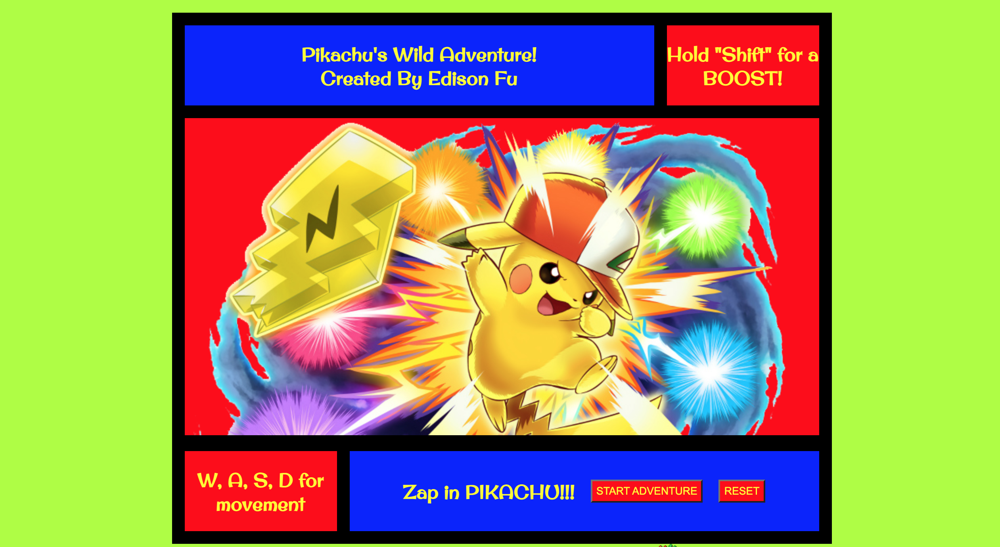

# Title of Game
Pikachu's Wild Adventure


# HOW TO PLAY
The player will play as Pikachu, Ash's beloved starter Pokemon of the Kanto League. Your goal as Pikachu is to avoid all other Pokemon and make your way to the very end. The movement keys will be "W, A, S, D" and the Pikachu may activate Quick Attack to dash 3x the normal distance by holding the "SHIFT" key. Pikachu starts with 6 lives and loses one as recoil everytime Pikachu collides into a Pokemon.



# HOW TO INSTALL

1. *`Fork`* and *`Clone`* Pikachus Wild Adventure to your local machine at 
https://github.com/Eddyfu45/Pikachus-Wild-Adventure.git
2. Open `index.html` in your browser to play
3. Open the directory in your text editor of choice to view or edit the code

# HOW IT WORKS


The core of the player and AI characters use this Pokemon class where certain properties and functions are defined.

```
class Pokemon {
    constructor (x ,y , color, width, height, img){
        this.x = x;
        this.y = y;
        this.color = color;
        this.width = width;
        this.height = height;
        this.img = img;
        this.alive = true;
        this.render = function() {
            ctx.fillStyle = this.color;
            ctx.drawImage(this.img, this.x, this.y, this.width, this.height);
        }
    }
}
```

The game itself goes through different functions at a set interval in order to check different statuses as well as movement and spawn times.

```
function gameLoop() {
    clearCanvas();
    nextLevel();
    level.textContent = `Level ${levelNum}`;
    spawnEnemy();
    renderEnemies();
    moveEnemy();
    player.pikarender();
    detectHit();
    lives.textContent = `Lives: ${livesNum}`;
    defeatScreen();
    timer += 1;
}
```

The game progresses based off the amount of time that has passed.

```
function nextLevel() {
    if ((timer % 500 == 0) && (timer > 0)) {
        levelNum += 1;
        changeScenery();
        enemyArray = [];
        speed += 2;
    }
}

function moveEnemy() {
    enemyArray.forEach(element => {
        element.y += speed;            
    });
}

function renderEnemies() {
    for (i = 0; i < enemyArray.length; i++) {
        if (enemyArray[i].alive == true) {
            enemyArray[i].render();
        }
    }
}
```

# FUTURE CONSIDERATIONS

Possible changes in the future can include projectiles for both Pikachu and the other Pokemon,
potions to pick up to recover life, cosmetic change of a party of 6 different Pokemon with 
Pikachu in the lead, and a moving background.